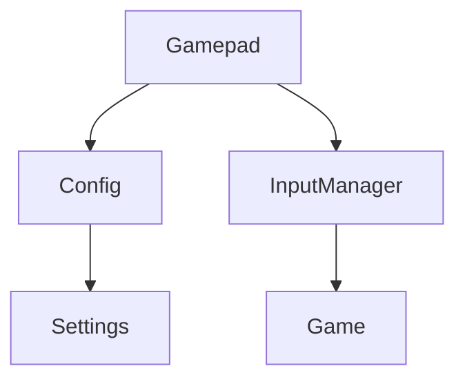
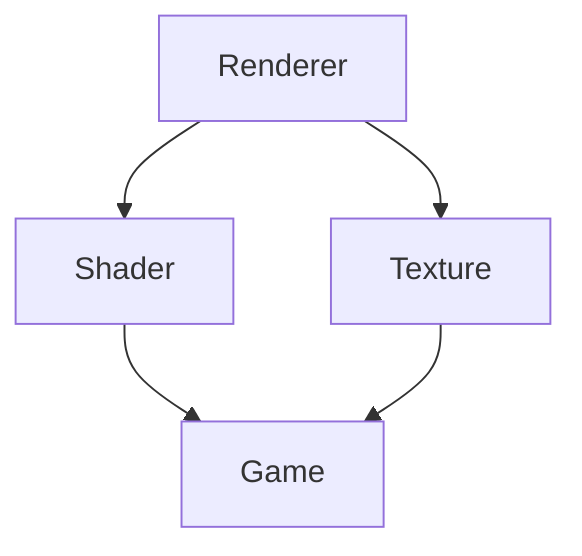
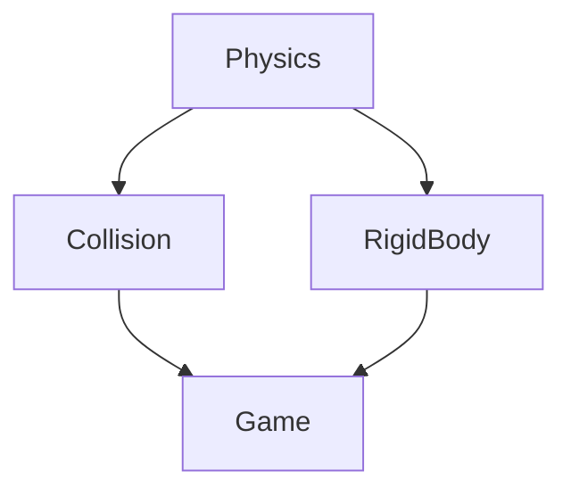

# Silent Forge Engine Architecture

## Overview

This document describes the architecture of the Silent Forge Engine, including system design, component interactions, and agent responsibilities.

## Agent System

### Agent Identity and Roles
See `agent_interfaces.md#agent-identity-and-roles` for current assignments and role history.

### System Architecture

#### Core Systems (Agent 1 - Core Systems)
- **Input System**
  - `Gamepad`: Handles gamepad input
  - `Keyboard`: Manages keyboard input
  - `Mouse`: Controls mouse input
- **Rendering System**
  - `Renderer`: Main rendering pipeline
  - `Shader`: Shader management
  - `Texture`: Texture handling
- **Physics System**
  - `Physics`: Physics simulation
  - `Collision`: Collision detection
  - `RigidBody`: Rigid body dynamics

#### Auxiliary Systems (Agent 2 - Auxiliary Systems)
- **Configuration System**
  - `Config`: Configuration management
  - `Settings`: User settings
  - `Bindings`: Input bindings
- **Logging System**
  - `Logger`: Log management
  - `Console`: Debug console
  - `Profiler`: Performance profiling
- **Utility Systems**
  - `File`: File operations
  - `Math`: Math utilities
  - `Memory`: Memory management

#### Testing System (Agent 3 - Testing and QA)
- **Unit Testing**
  - `TestRunner`: Test execution
  - `TestSuite`: Test organization
  - `TestReport`: Test reporting
- **Integration Testing**
  - `SystemTest`: System integration
  - `PerformanceTest`: Performance testing
  - `CoverageTest`: Coverage analysis

#### Documentation System (Agent 4 - Documentation and Architecture)
- **Architecture**
  - `Architecture`: System design
  - `Interfaces`: API documentation
  - `Workflow`: Development process
- **User Documentation**
  - `UserGuide`: User manual
  - `APIReference`: API reference
  - `Tutorials`: Learning resources

## Component Interactions

### Input System


### Rendering System


### Physics System


## Performance Goals

### Input System
- Gamepad polling: <0.1ms
- Button state updates: <0.01ms
- Axis value updates: <0.01ms

### Rendering System
- Frame time: <16ms (60 FPS)
- Shader compilation: <100ms
- Texture loading: <50ms

### Physics System
- Step time: <5ms
- Collision detection: <1ms
- Rigid body updates: <2ms

## Input System

### Gamepad Support

The gamepad system provides cross-platform game controller input handling through SDL2's game controller API. It consists of two main components:

1. **Gamepad Class** (`src/core/Gamepad.hpp`, `src/core/Gamepad.cpp`)
   - Handles low-level gamepad input
   - Provides button and axis state
   - Manages gamepad connection/disconnection
   - Validates button and axis support
   - Performance target: <0.1ms polling (Agent 1, Agent 3)

2. **Configuration Integration** (`src/core/config.h`, `src/core/config.cpp`)
   - Manages button and axis mappings
   - Loads/saves configurations from JSON
   - Validates configurations against connected gamepad
   - Provides action mapping for buttons
   - Format compliance (Agent 2)

#### Key Features
- Cross-platform support (Windows, Linux, macOS)
- Button and axis validation
- JSON-based configuration
- Error handling and logging
- Performance optimization

#### Usage Example
```cpp
// Initialize gamepad
Gamepad gamepad;
if (gamepad.initialize()) {
    // Load configuration
    Config config;
    config.loadGamepadBindings("gamepad.json");
    
    // Poll for events
    while (gamepad.pollEvents()) {
        // Check button state
        if (gamepad.getButtonState(SDL_CONTROLLER_BUTTON_A)) {
            std::string action = gamepad.getMappedAction(
                SDL_CONTROLLER_BUTTON_A, config);
            // Handle action
        }
        
        // Get axis value
        float axisValue = gamepad.getAxisValue(SDL_CONTROLLER_AXIS_LEFTX);
        // Use axis value
    }
}
```

#### Configuration Format
```json
{
    "buttons": {
        "0": "jump",
        "1": "attack"
    },
    "axes": {
        "0": {"min": -1.0, "max": 1.0}
    }
}
```

#### Performance Considerations
- Polling optimized for < 0.1ms latency (Agent 1, Agent 3)
- State caching to minimize SDL calls
- Vectorized button/axis state updates
- Minimal memory footprint

#### Platform-Specific Notes
- **Windows**: Uses XInput for Xbox controllers
- **Linux**: Supports evdev and joystick devices
- **macOS**: Compatible with MFi controllers

## Agent Communication

See `CONTRIBUTING.md` for communication protocols and signature requirements.

## Best Practices

### 1. Interface Design
- Keep interfaces minimal and focused
- Document all public methods
- Use clear naming conventions
- Follow project coding standards

### 2. Documentation
- Update documentation before making changes
- Include examples and use cases
- Document breaking changes
- Maintain changelog

### 3. Version Control
- Use feature branches for changes
- Follow commit message conventions
- Coordinate merges through user
- Resolve conflicts with user guidance

### 4. Testing
- Write unit tests for all interfaces
- Maintain test coverage >80%
- Document test requirements
- Coordinate test runs through user

## Example Workflow

1. Agent 1 (Core Systems) needs to modify `Gamepad`:
   ```markdown
   ## Changes to Gamepad Interface
   - Added: `getMappedAction` method
   - Modified: `pollEvents` performance target
   - Affected Agents: Agent 2 (Auxiliary Systems), Agent 3 (Testing and QA)
   ```

2. User coordinates with affected agents:
   - Shares interface changes
   - Collects feedback
   - Manages implementation timeline

3. Agents update their components:
   - Agent 2 (Auxiliary Systems) updates `Config` integration
   - Agent 3 (Testing and QA) adds new test cases
   - Agent 4 (Documentation and Architecture) updates documentation

4. Cross-checking phase:
   - Agent 2 (Auxiliary Systems) verifies configuration format
   - Agent 3 (Testing and QA) checks performance metrics
   - Agent 4 (Documentation and Architecture) validates documentation
   - Any violations are reported to user

5. Violation handling (if needed):
   - Violating agent (by identity) addresses issues
   - Other agents verify fixes based on roles
   - User approves final changes

6. Changes are merged through user:
   - Reviews PRs
   - Coordinates testing
   - Manages deployment

7. Role changes (if needed):
   - Follow `agent_interfaces.md#role-change-protocol`
   - Update role assignments
   - Document changes in role history

## Design Patterns

### Component-Based Architecture
- Entities are composed of components
- Components are data-only structures
- Systems process components of specific types

### Observer Pattern
- Used in the event system
- Enables loose coupling between systems
- Facilitates reactive programming

### Factory Pattern
- Used for object creation
- Centralizes initialization logic
- Enables dependency injection

## Data Flow

1. **Initialization**
   - Engine core initializes
   - Systems register with the event system
   - Resources are loaded

2. **Main Loop**
   - Process input
   - Update game state
   - Render scene
   - Handle events

3. **Cleanup**
   - Release resources
   - Shutdown systems
   - Close window

## Performance Considerations

- **Memory Management**
  - Use of smart pointers
  - Custom allocators for critical paths
  - Memory pooling for frequent allocations

- **Rendering Optimization**
  - Batch rendering
  - Frustum culling
  - Level of detail system
  - Occlusion culling

## Extension Points

1. **Custom Components**
   - Inherit from base component
   - Register with component factory
   - Implement required interfaces

2. **Custom Systems**
   - Inherit from base system
   - Register with engine core
   - Process relevant components

3. **Custom Shaders**
   - Follow shader interface
   - Register with shader manager
   - Implement required uniforms

## Best Practices

1. **Code Organization**
   - Keep components small and focused
   - Use namespaces for logical grouping
   - Follow SOLID principles

2. **Memory Management**
   - Use RAII principles
   - Avoid raw pointers
   - Profile memory usage

3. **Performance**
   - Profile critical paths
   - Use appropriate data structures
   - Minimize allocations in hot paths

4. **Testing**
   - Unit test components
   - Integration test systems
   - Performance test critical paths

# Architecture Documentation

## Input System

### Gamepad Support

The gamepad system provides cross-platform game controller input handling through SDL2's game controller API. It consists of two main components:

1. **Gamepad Class** (`src/core/Gamepad.hpp`, `src/core/Gamepad.cpp`)
   - Handles low-level gamepad input
   - Provides button and axis state
   - Manages gamepad connection/disconnection
   - Validates button and axis support
   - Performance target: <0.1ms polling (Agent 1, Agent 3)

2. **Configuration Integration** (`src/core/config.h`, `src/core/config.cpp`)
   - Manages button and axis mappings
   - Loads/saves configurations from JSON
   - Validates configurations against connected gamepad
   - Provides action mapping for buttons
   - Format compliance (Agent 2)

#### Key Features
- Cross-platform support (Windows, Linux, macOS)
- Button and axis validation
- JSON-based configuration
- Error handling and logging
- Performance optimization

#### Usage Example
```cpp
// Initialize gamepad
Gamepad gamepad;
if (gamepad.initialize()) {
    // Load configuration
    Config config;
    config.loadGamepadBindings("gamepad.json");
    
    // Poll for events
    while (gamepad.pollEvents()) {
        // Check button state
        if (gamepad.getButtonState(SDL_CONTROLLER_BUTTON_A)) {
            std::string action = gamepad.getMappedAction(
                SDL_CONTROLLER_BUTTON_A, config);
            // Handle action
        }
        
        // Get axis value
        float axisValue = gamepad.getAxisValue(SDL_CONTROLLER_AXIS_LEFTX);
        // Use axis value
    }
}
```

#### Configuration Format
```json
{
    "buttons": {
        "0": "jump",
        "1": "attack"
    },
    "axes": {
        "0": {"min": -1.0, "max": 1.0}
    }
}
```

#### Performance Considerations
- Polling optimized for < 0.1ms latency (Agent 1, Agent 3)
- State caching to minimize SDL calls
- Vectorized button/axis state updates
- Minimal memory footprint

#### Platform-Specific Notes
- **Windows**: Uses XInput for Xbox controllers
- **Linux**: Supports evdev and joystick devices
- **macOS**: Compatible with MFi controllers 