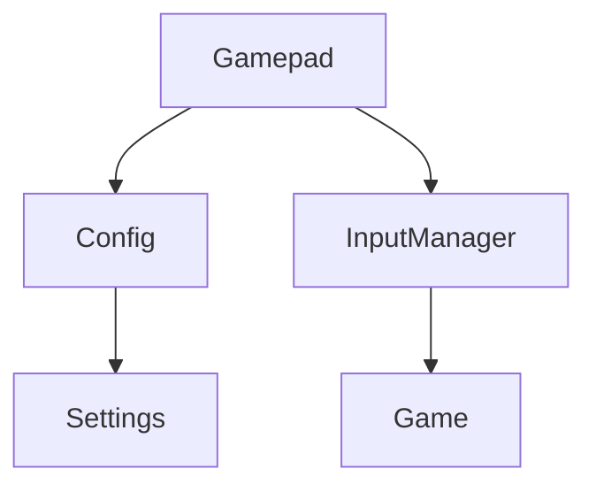
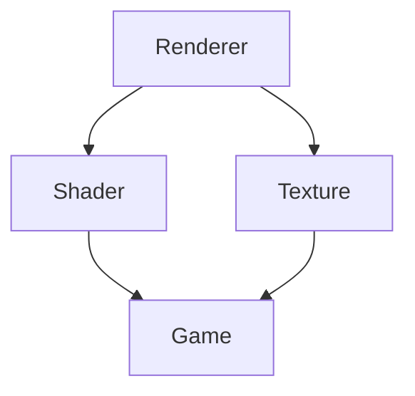
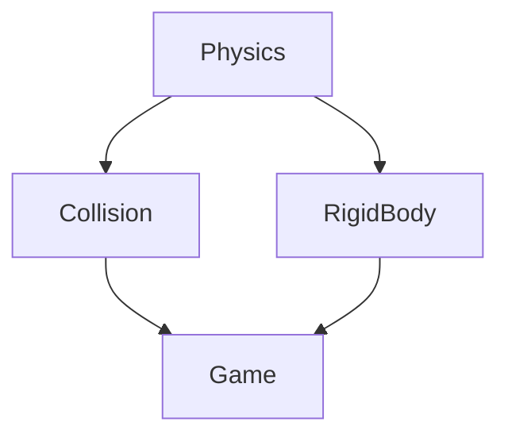

# Silent Forge Engine Architecture

## Overview

This document describes the architecture of the Silent Forge Engine, including system design, component interactions, and agent responsibilities.

## System Architecture

### Core Systems (Agent 1)
- **Input System**
  - `Gamepad`: Handles gamepad input
  - `Keyboard`: Manages keyboard input
  - `Mouse`: Controls mouse input
- **Rendering System**
  - `Renderer`: Main rendering pipeline
  - `Shader`: Shader management
  - `Texture`: Texture handling
- **Physics System**
  - `Physics`: Physics simulation
  - `Collision`: Collision detection
  - `RigidBody`: Rigid body dynamics

### Auxiliary Systems (Agent 2)
- **Configuration System**
  - `Config`: Configuration management
  - `Settings`: User settings
  - `Bindings`: Input bindings
- **Logging System**
  - `Logger`: Log management
  - `Console`: Debug console
  - `Profiler`: Performance profiling
- **Utility Systems**
  - `File`: File operations
  - `Math`: Math utilities
  - `Memory`: Memory management

### Testing System (Agent 3)
- **Unit Testing**
  - `TestRunner`: Test execution
  - `TestSuite`: Test organization
  - `TestReport`: Test reporting
- **Integration Testing**
  - `SystemTest`: System integration
  - `PerformanceTest`: Performance testing
  - `CoverageTest`: Coverage analysis

### Documentation System (Agent 4)
- **Architecture**
  - `Architecture`: System design
  - `Interfaces`: API documentation
  - `Workflow`: Development process
- **User Documentation**
  - `UserGuide`: User manual
  - `APIReference`: API reference
  - `Tutorials`: Learning resources

## Component Interactions

### Input System


### Rendering System


### Physics System


## Agent Communication

### Interface Documentation
- Each agent must document their interfaces in `docs/agent_interfaces.md`
- Include:
  - Interface purpose and scope
  - Dependencies and requirements
  - Usage examples
  - Known limitations

### Change Notification
- When making changes that affect other agents:
  1. Update relevant documentation
  2. Create a PR with clear description
  3. Tag affected agents in comments
  4. User coordinates review and feedback

### Dependency Management
- Agents must declare dependencies in:
  - `CMakeLists.txt`
  - `vcpkg.json`
  - `docs/DEPENDENCIES.md`
- Coordinate dependency updates through user

### Testing Requirements
- Agent 3 defines testing requirements
- Other agents must:
  - Provide testable interfaces
  - Document test cases
  - Maintain test coverage

## Best Practices

### 1. Interface Design
- Keep interfaces minimal and focused
- Document all public methods
- Use clear naming conventions
- Follow project coding standards

### 2. Documentation
- Update documentation before making changes
- Include examples and use cases
- Document breaking changes
- Maintain changelog

### 3. Version Control
- Use feature branches for changes
- Follow commit message conventions
- Coordinate merges through user
- Resolve conflicts with user guidance

### 4. Testing
- Write unit tests for all interfaces
- Maintain test coverage >80%
- Document test requirements
- Coordinate test runs through user

## Example Workflow

1. Agent 1 needs to modify `Gamepad`:
   ```markdown
   ## Changes to Gamepad Interface
   - Added: `getMappedAction` method
   - Modified: `pollEvents` performance target
   - Affected Agents: Agent 2 (Config), Agent 3 (Tests)
   ```

2. User coordinates with affected agents:
   - Shares interface changes
   - Collects feedback
   - Manages implementation timeline

3. Agents update their components:
   - Agent 2 updates `Config` integration
   - Agent 3 adds new test cases
   - Agent 4 updates documentation

4. Changes are merged through user:
   - Reviews PRs
   - Coordinates testing
   - Manages deployment 